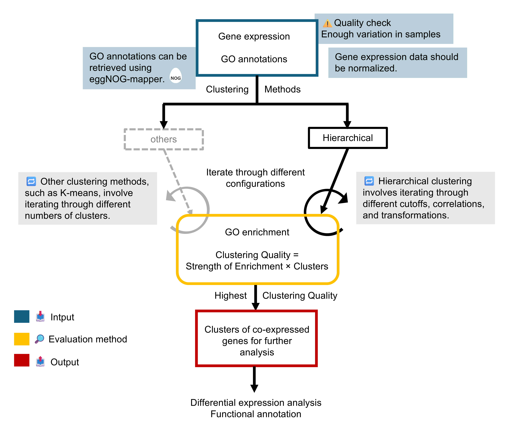

# ClustTuneGO: Computational Pipeline for Gene Clustering using RNA-Seq Data

ClustTuneGO is a computational pipeline designed to systematically evaluate clustering configurations for gene expression data using biologically informed validation based on Gene Ontology enrichment.

To analyze large-scale expression datasets, one common approach is to group genes with similar expression patterns into clusters and then study these clusters. This approach enables more manageable analysis by reducing dimensionality—from thousands of individual genes to hundreds of co-expressed gene clusters potentially involved in the same biological responses. Despite numerous proposed clustering methods, there is no consensus on which algorithm performs best for a given dataset. Furthermore, determining the optimal parameters for a chosen algorithm remains an open question.
The goal of this project was to develop a systematic approach for identifying optimal clustering configurations for gene expression data. We designed a reproducible clustering pipeline with a detailed focus on hierarchical clustering, including the selection of the optimal dendrogram cut height. We validated the pipeline using a well-characterized Bacillus subtilis dataset and then applied it to cluster genes in a Thermothelomyces thermophilus (C1) RNA-seq dataset. The pipeline can be applied to other datasets and adapted to evaluate different clustering methods.
